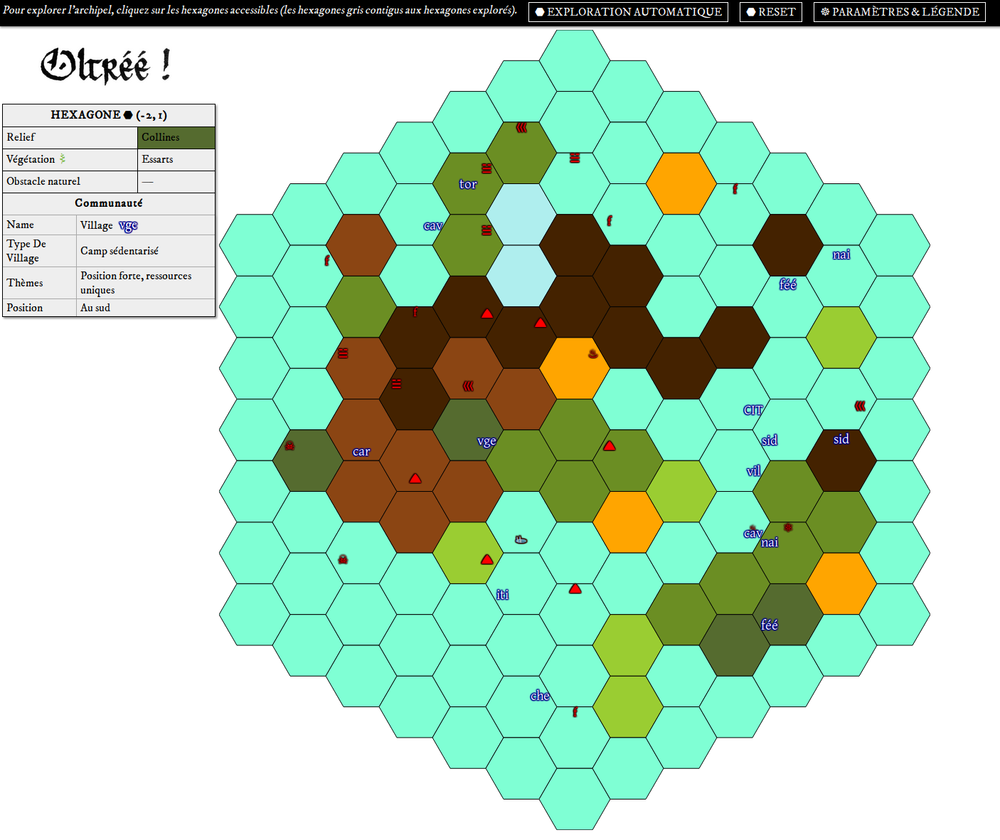

# Une procédure pour générer dynamiquement des cartes de hexcrawl (application à Oltréé !)

<!--
## Motivation

[Oltréé !](http://johndoe-rpg.com/catalogue/oltree) est un JDR encourageant le jeu « sandbox » et favorisant la création dynamique du contenu narratif (par le recours à l'improvisation et à des outils de narration partagée). Si le travail de préparation du MJ s'en trouve considérablement réduit, il est toutefois nécessaire de préparer la carte qui servira de support à l'aventure. Cette contribution propose une méthode pour supprimer cette étape de création de la carte *a priori* du jeu.
Le MJ peut ainsi lancer une campagne avec uniquement quelques notes sur les factions qu'il veut convoquer (c'est-à-dire 15 minutes dans un bus avec un bloc-note et un stylo).
-->

## Test

	npm i
	npm run b-watch
	-> http://localhost:3333